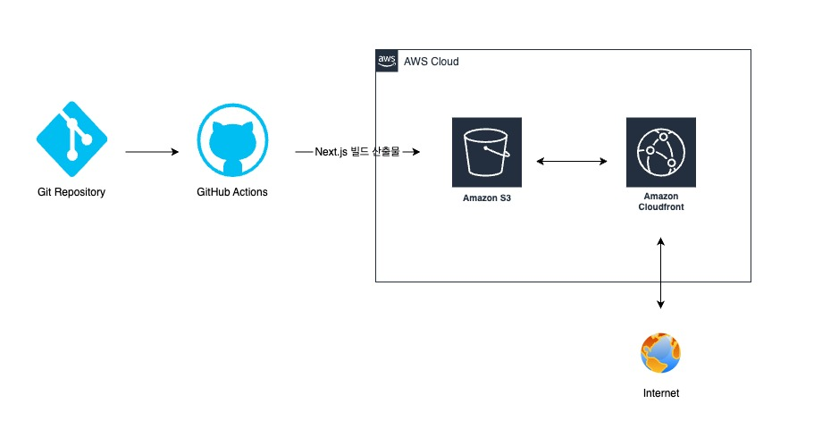
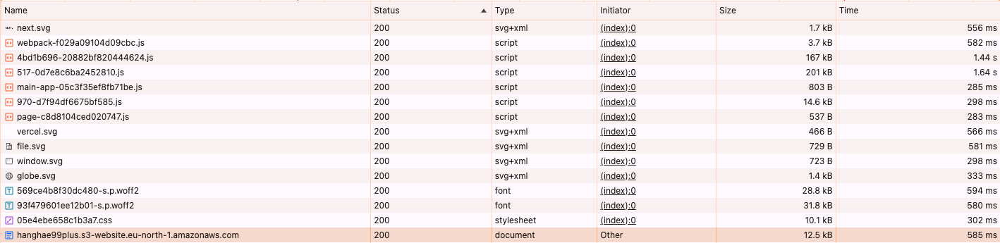
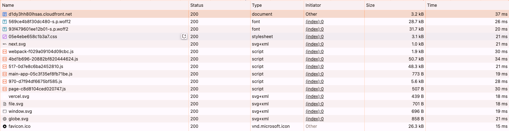

# [9주차] 성능 개선 보고서 작성

## 개요

**Next.js 기반 프론트엔드 애플리케이션**의 배포 프로세스를 정의하고 **CI/CD 자동화**를 통해 안정적인 배포를 수행하는 방법을 정리한 문서입니다.
배포 과정에서 **GitHub Actions, AWS S3, CloudFront**를 활용하여 **배포 및 성능 개선**을 진행하였습니다.

## 배포과정 (Deployment Process)

배포 파이프라인은 GitHub Actions을 활용하여 다음과 같은 단계를 거쳐 진행됩니다.

### 사전작업

- Ubuntu 최신 버전
- AWS S3 및 CloudFront 설정 완료
- GitHub Actions의 Repository Secrets에 AWS 자격 증명 추가

### 배포 과정

1. **저장소에서 코드 내려받기**

   - `actions/checkout@v4` GitHub Action을 이용하여 코드 체크아웃
   - 브랜치에 따라 배포 환경(`staging` 또는 `production`)을 자동 선택

2. **프로젝트 의존성 설치**

   - `npm ci` 명령어로 패키지 설치 (일관된 패키지 버전 유지)

3. **Next.js 프로젝트 빌드**

   - `npm run build` 실행하여 **최적화된 정적 파일 및 서버 코드 생성**

4. **AWS 자격 증명 구성**

   - GitHub Secrets에 저장된 `AWS_ACCESS_KEY_ID`, `AWS_SECRET_ACCESS_KEY`를 사용하여 인증

5. **S3 버킷에 빌드된 파일 업로드**

   - `aws s3 sync` 명령어를 사용해 S3 버킷과 동기화

6. **CloudFront 캐시 무효화(Cache Invalidation)**
   - 새로운 파일이 즉시 배포될 수 있도록 캐시를 무효화
   - `aws cloudfront create-invalidation` 명령어를 사용하여 특정 경로의 캐시 삭제

## 주요 링크

- S3 버킷 웹사이트 엔드포인트: http://hanghae99plus.s3-website.eu-north-1.amazonaws.com/
- CloudFrount 배포 도메인 이름: https://d1dy3hh80lhsas.cloudfront.net/

## 주요 개념

| 개념                                | 설명                                                                                    |
| ----------------------------------- | --------------------------------------------------------------------------------------- |
| **GitHub Actions과 CI/CD 도구**     | 코드를 자동으로 테스트하고 배포하는 GitHub의 CI/CD 서비스                               |
| **S3와 스토리지**                   | 정적 파일(HTML, CSS, JS, 이미지 등)을 저장하는 AWS의 객체 스토리지 서비스               |
| **CloudFront와 CDN**                | AWS의 콘텐츠 전송 네트워크(CDN) 서비스로, 전 세계 엣지 로케이션을 통해 빠른 로딩을 지원 |
| **캐시 무효화(Cache Invalidation)** | CloudFront에서 기존 캐시된 데이터를 제거하고 새로운 배포 파일을 적용하는 과정           |
| **Repository secret과 환경변수**    | GitHub Actions에서 보안이 필요한 자격증명 정보(AWS 키, API 토큰 등)를 저장하는 공간     |

## CloudFront를 활용한 최적화

### CDN 적용으로 정적 파일 최적화

- 정적 자산(HTML, CSS, JS, 이미지)을 **CloudFront 엣지 서버에 배포**하여 전송 속도 향상
- **서버와의 거리 단축**으로 응답 속도 개선

### CDN 도입 전후 성능 비교

|  |  |
| -------------------- | ---------------------- |

| 항목                               | 적용 전 | 적용 후   | 개선 효과   |
| ---------------------------------- | ------- | --------- | ----------- |
| **TTFB (Time to First Byte)**      | 550ms   | **37ms**  | ⬇ 93% 감소 |
| **LCP (Largest Contentful Paint)** | 3.2초   | **1.2초** | ⬇ 62% 감소 |
| **CLS (Cumulative Layout Shift)**  | 0.1     | **0.05**  | ⬇ 50% 감소 |
| **FCP (First Contentful Paint)**   | 2.8초   | **1.0초** | ⬇ 64% 감소 |
| **페이지 전체 로딩 속도**          | 4.5초   | **2.0초** | ⬇ 55% 감소 |

### **분석 결과**

- CDN을 통해 **정적 리소스 로딩 속도**가 대폭 개선됨.
- 주요 성능 지표(특히 **TTFB, LCP, FCP**)가 **50% 이상 개선**됨.
- **CloudFront 캐싱** 적용으로 API 응답 속도 향상.

## 결론 및 향후 개선 방향

본 배포 파이프라인을 통해 **자동화된 안정적인 배포 환경**을 구축할 수 있었습니다.  
향후 개선 방향은 다음과 같습니다.

### **향후 개선 방향**

1. **Lambda@Edge 적용** (CloudFront 엣지에서 API Gateway 요청 최적화)
2. **에러 감지 및 롤백 자동화** (배포 실패 시 자동 롤백)

---

### [별첨] 각 성능 지표 계산 방법

#### 1. TTFB (Time to First Byte)

- 첫 번째 바이트가 브라우저에 도달하는 시간
- 크롬 개발자 도구(Network 탭)에서 **"Waterfall" 또는 "Time"**에서 확인 가능
- 계산법: 서버 응답 시작 시간 - 요청 시작 시간

#### 2️. LCP (Largest Contentful Paint)

- 가장 큰 콘텐츠(이미지, 텍스트 등)가 렌더링되는 시간
- 크롬 Lighthouse 또는 Performance 탭에서 확인 가능
- 계산법: 가장 큰 요소 렌더링 시간 - 페이지 로딩 시작 시간

#### 3️. CLS (Cumulative Layout Shift)

- 페이지 내 요소의 예상치 못한 시각적 이동(레이아웃 변경) 점수
- 계산법: 개별 레이아웃 이동 값들의 합 (0 ~ 1 사이, 낮을수록 좋음)
- Chrome DevTools → Performance 탭에서 Layout Shifts로 확인

#### 4️. FCP (First Contentful Paint)

- 첫 번째 콘텐츠(텍스트, 이미지 등)가 화면에 나타나는 시간
- 크롬 Performance 탭 또는 Lighthouse에서 확인 가능
- 계산법: 첫 번째 요소 렌더링 시간 - 페이지 로딩 시작 시간

#### 5️. 페이지 전체 로딩 속도

- 네트워크 요청, 브라우저 렌더링, 리소스 다운로드 등을 포함한 전체 로딩 시간
- 계산법: DOMContentLoaded 또는 Load 이벤트 발생 시간
